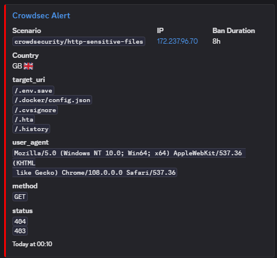

+++
date = '2025-04-20T00:00:00+02:00'
draft = false
title = 'How To Set Up Caddy With Crowdsec Behind a Cloudflare Proxy'
description = 'Step-by-step guide to securing a site using Caddy + CrowdSec behind Cloudflare proxy, with configuration tips for improved protection.'
categories = ['Homelab']
tags = ['Caddy', 'Security', 'WAF', 'Crowdsec', 'Docker', 'Tutorial', 'Self Hosting']
+++

And find out how scary exposing services can be.

## Intro

When you start exposing services from your homelab to the internet, security quickly becomes a serious concern. Every open port is a potential attack vector, and automated bots are constantly scanning for vulnerabilities. That’s where Caddy, CrowdSec, and Cloudflare come in — together they form a powerful, layered security setup that protects your apps while still making them accessible.

Here’s what each component does and why it matters:

**Cloudflare** – acts as a shield between the internet and your server. It hides your IP address, absorbs DDoS attacks, and filters out a huge amount of bad traffic before it even reaches you.

**Caddy** – a modern, easy-to-use web server and reverse proxy that automatically handles HTTPS, SSL certificates and routes traffic to your services. With the right plugins, it can also talk to CrowdSec to block malicious requests in real time.

**CrowdSec** – a collaborative intrusion prevention system (like Fail2Ban on steroids) that analyzes logs from your services, detects malicious behavior, and shares information about bad actors with the community.

**AppSec** (WAF) – an optional CrowdSec component that acts as a Web Application Firewall (WAF), inspecting requests and dropping suspicious payloads before they can reach your apps.

By combining these tools, you get:

✅ Real-time protection – CrowdSec can block known bad IPs globally and react immediately to malicious traffic.

✅ Log-driven detection – Instead of relying on static IP lists, it monitors what’s happening in your logs and bans attackers dynamically.

✅ Layered security – Cloudflare stops most noise, CrowdSec catches what gets through, and Caddy enforces the blocks.

✅ Easy observability – You can track attacks, ban durations, and get Discord notifications when something happens.

In short, this setup gives you peace of mind when self-hosting: you stay in control of what’s exposed, you can still access everything securely, and you significantly reduce your attack surface without relying solely on obscurity.

## Basic Setup

### 1. Building Caddy With The Right Dependencies {#setup}
You'll need a few things to get this to work:
```dockerfile
FROM caddy:2.9.1-builder-alpine AS builder

RUN xcaddy build \
    --with github.com/caddy-dns/cloudflare \
    --with github.com/hslatman/caddy-crowdsec-bouncer/http \
    --with github.com/hslatman/caddy-crowdsec-bouncer/appsec \
    --with github.com/WeidiDeng/caddy-cloudflare-ip

FROM caddy:2.9.1

COPY --from=builder /usr/bin/caddy /usr/bin/caddy
```

`github.com/WeidiDeng/caddy-cloudflare-ip` is optional. Use this if you are proxied behind cloudflare to get the correct IPs making requests to your services instead of CFs IPs.

`github.com/hslatman/caddy-crowdsec-bouncer/appsec` is optional if you don't want to install the appsec/WAF component.

### 2. Getting Logs From Your Services
Crowdsec works by parsing logs. So you'll wanna set caddy up to actually generate them as by default it doesn't.
The way I did this is to have a function you can import with an argument defining the name of the log:

Caddyfile:
```caddy
# Logging Config
(logging) {
	log {
		output file /var/log/caddy/{args[0]}.access.log
	}
}
```
Check the output on your end to whatever you've got mapped on docker side of things.

Then import this in your service and pass in an arg for the name of the file. Makes it super easy to differentiate logs:
```caddy
# me.kidami.xyz
me.kidami.xyz {
	import logging me.kidami.xyz
	reverse_proxy <IP:PORT>
}
```
Do this for all your services and you'll have nicely split log files:
```sh
root@HomeServer:/mnt/user/appdata/caddy/logs# ls
access.log                  immich.kidami.xyz.access.log  scrumptious.kidami.xyz.access.log
auth.kidami.xyz.access.log  me.kidami.xyz.access.log      wiki.kidami.xyz.access.log
```

### 3. Installing And Configuring Crowdsec
I used IBRACORP's template from UNRAID's community apps.
Only a few things you need to change from defaults:
1. In collections add: `crowdsecurity/caddy`
2. I changed the 'auth logs to analyze' field and mapped it to `/var/log/caddy` within the container and `/mnt/user/appdata/caddy/logs/` locally to give crowdsec easy access to caddy logs. By default this comes mapped to a single file.

You then need to activate the bouncer and generate an API key by running the following in the crowdsec container:
```sh
cscli bouncers add caddy-bouncer
```

Save this API key and put it in caddy's docker-compose env.

Now we need to tell crowdsec where to look for the logs. Luckily this is pretty simple - in crowdsec's appdata folder modify `acquis.yaml`. The important things here are the types. This is what the caddy collection was for.
```yaml
filenames:
 - /syslog
labels:
  type: syslog
---
filenames:
  - /var/log/caddy/*.log
labels:
  type: caddy
```

The crowdsec docker container will raise warnings if this wasn't set up correctly.

### 4. Adding Crowdsec To Caddy
In your Caddyfile's global config (the very top one!)
```caddy
order crowdsec first
crowdsec {
	api_url http://<IP>:8081
	api_key {env.CROWDSEC_API_KEY}
	ticker_interval 15s
}
```

Optional - add this if you are proxied behind CF:
```caddy
	servers {
		trusted_proxies cloudflare {
			interval 12h
			timeout 15s
    }
```

Finally, add this to every service you want to put behind crowdsec:
```caddy
me.kidami.xyz {
	route {
		crowdsec
	}
	import logging me.kidami.xyz
	reverse_proxy <IP>:<PORT>
 ```
 
 ### 5. Testing
If caddy doesn't immediately kill itself you should be seeing logs in the crowdsec container:
 ```
 time="2024-12-16T23:32:54+01:00" level=info msg="172.17.0.1 - [Mon, 16 Dec 2024 23:32:54 CET] \"GET /v1/decisions/stream HTTP/1.1 200 93.156225ms \"caddy-cs-bouncer/v0.7.0\" \""
 ```
This shows that the caddy bouncer is working and getting decisions.
 
To test that it actually works, exec into the crowdsec container and do:
 ```sh
 cscli decisions add --ip <IP>
 ```
Give it a few seconds to take action and any domain you've put behind crowdsec should now be inacessible by that IP.
If this is not the case check the access logs and see if the actual request IP matches. This caused me a lot of issues as cloudflare was putting the actual IPs elsewhere in the headers hence the whole extra step to make it work. 

Other useful commands:

Checking/removing decisions:
```sh
cscli decisions list
cscli decisions delete --ip <IP>
```

Checking log parsing:
```sh
cscli explain --file /var/log/caddy/xxx.access.log --type caddy
```

Adding scenarios/collections:
```sh
cscli collections install crowdsecurity/base-http-scenarios
```

## Appsec Component Setup
### 1. Check Dependencies
Make sure you've built the caddy server with the appsec component in the [initial setup section](#setup)

### 2. Modify acquis.yaml
Add the following, choosing a port of your choice:
```yaml
listen_addr: 0.0.0.0:7422
appsec_config: crowdsecurity/appsec-default
name: myAppSecComponent
source: appsec
labels:
  type: appsec
```


You will have to expose this port in your crowdsec docker container.


### 3. Install Some Appsec Rules
```sh
cscli collections install crowdsecurity/appsec-virtual-patching
cscli collections install crowdsecurity/appsec-generic-rules
```

Restart crowdsec.

You should see the following log:
```
INFO[2023-12-05 09:16:31] 1 appsec runner to start                      type=appsec
INFO[2023-12-05 09:16:31] Starting Appsec server on 0.0.0.0:7422/     type=appsec
```

### 4. Configure Appsec In Caddyfile
Add appsec clause and URL:
```caddy
	crowdsec {
		api_url http://<IP>:8081
		appsec_url http://<IP>:7422
		api_key {env.CROWDSEC_API_KEY}
		ticker_interval 15s
	}
```

Add appsec directive to domains you want to protect:
```caddy
me.kidami.xyz {
  route {
  	appsec
    crowdsec
  }
  import logging me.kidami.xyz
  reverse_proxy <IP>:<PORT>
```

The route order matters and appsec should come before crowdsec. You want the WAF to drop bad requests before they get anywhere.


Appsec should now be enabled!

### 5. Testing
Try to access an appsec connected domain and add `/rpc2` to the end of the URL. It should be automatically blocked. Note that usually appsec alerts aren't immediately banned unless you [tweak your profiles.yaml](#profiles). 

## Further Crowdsec Config
### [profiles.yaml](https://docs.crowdsec.net/u/getting_started/post_installation/profiles/) {#profiles}
You can change the ban times here and filters which decide which alerts receive bans, eg:
```yaml
filters:
 - Alert.Remediation == true && Alert.GetScope() == "Ip"
```
Would ban alerts triggered by an IP address only if the alert calls for a remediation
```yaml
filters:
 - Alert.GetScope() == "Ip"
```
Whereas here any IP triggering any alert will get banned.

You can also link each remediation to a notification agent such as discord.

### Example Discord Notifications Config


Place in `appdata/crowdsec/notifications/discord.yaml'

```yaml
type: http
name: discord
log_level: info
trigger: alert
format: |
  {
    "embeds": [
      {
        {{range . -}}
        {{$alert := . -}}
        {{range .Decisions -}}
        "timestamp": "{{$alert.StartAt}}",
        "title": "Crowdsec Alert",
        "color": 16711680,
        "url": "https://app.crowdsec.net/cti/{{.Value}}",
        "fields": [
              {
                "name": "Scenario",
                "value": "`{{ .Scenario }}`",
                "inline": "true"
              },
              {
                "name": "IP",
                "value": "[{{.Value}}](<https://www.whois.com/whois/{{.Value}}>)",
                "inline": "true"
              },
              {
                "name": "Ban Duration",
                "value": "{{.Duration}}",
                "inline": "true"
              },
              {{if $alert.Source.Cn -}}
              { 
                "name": "Country",
                "value": "{{$alert.Source.Cn}} :flag_{{ $alert.Source.Cn | lower }}:",
                "inline": "true"
              }
              {{end}}
              {{if not $alert.Source.Cn -}}
              { 
                "name": "Location",
                "value": "Unknown :pirate_flag:"
              }
              {{end}}
              {{end -}}
              {{end -}}
              {{range . -}}
              {{$alert := . -}}
              {{range .Meta -}}
                ,{
                "name": "{{.Key}}",
                "value": "{{ (splitList "," (.Value | replace "\"" "`" | replace "[" "" |replace "]" "")) | join "\\n"}}"
              } 
              {{end -}}
              {{end -}}
        ]
      }
    ]
  } 
url: https://discord.com/api/webhooks/123
method: POST
headers:
  Content-Type: application/json
```

