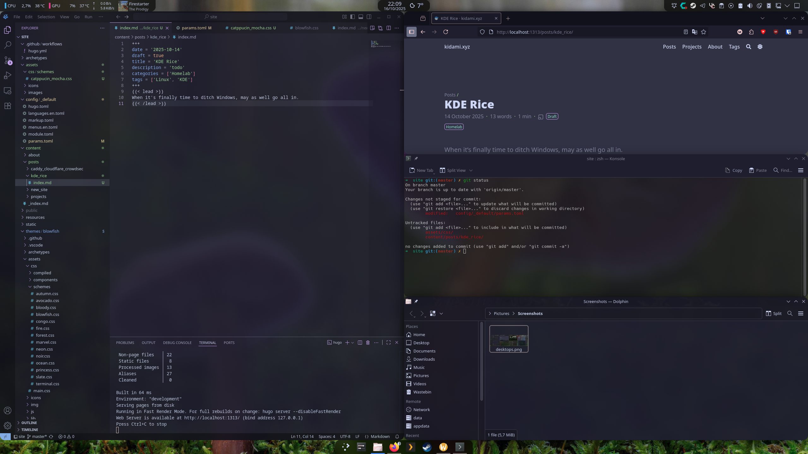
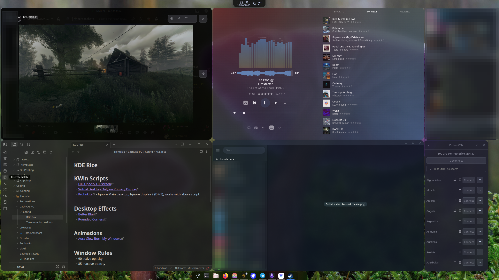

+++
date = '2025-10-14'
draft = false
title = 'CachyOS KDE Rice'
description = 'A customized KDE Plasma setup combining tiling and traditional layouts using Krohnkite, CachyOS, and a blend of blur and rounded effects for a sleek, hybrid desktop experience.'
categories = ['Homelab']
tags = ['Linux', 'KDE', 'CachyOS', 'Rice', 'Customization']
+++

A “My First Rice” post was not on my 2025 bingo sheet.


I’ve been meaning to ditch Windows as my main OS for a while now, but could never quite be bothered. Recently, some friends switched to **CachyOS** and were quite happy about it, including that most games work out of the box — so I finally made the jump.

For the desktop environment, I considered going for **Hyprland**, but CachyOS warned that it’s not fully stable yet, plus I think I’d prefer to keep _some_ of the simplicity of KDE.

After spending a few days customizing, I managed to come up with a pretty nice hybrid setup that I’m quite happy with.

---

## The Hybrid Setup — What’s “Hybrid” About It?

I run two virtual desktops:
- **Main** – used for web browsing and gaming with standard KDE behavior.  
- **Tiled** – powered by **Krohnkite**, used for dev work and productivity.

KDE on one desktop, Hyprland-lite via Krohnkite on another. Another cool thing is that switching virtual desktops doesn’t affect my secondary monitor, which stays static for apps like Discord, Signal, and Plexamp.

---

## Screenshots

---

## Setup

### KWin Scripts

#### [Full Opacity Fullscreen](https://github.com/Zineffable1/kwin-FSopacity/tree/main)
A handy little helper that temporarily restores 100% opacity for fullscreen programs.

#### [Virtual Desktop Only on Primary Display](https://store.kde.org/p/2143363)
Perfect for multi-monitor setups where you want virtual desktop switching on your primary screen only.

#### [Krohnkite](https://github.com/anametologin/krohnkite)
As mentioned earlier, this enables tiling on my main display — but only for my main monitor and not across all desktops.

---

### Desktop Effects

#### [Better Blur](https://github.com/taj-ny/kwin-effects-forceblur)
Adds blur to transparent windows, which looks much nicer than plain transparency.  
Note: Windows must be slightly transparent for it to take effect — you can adjust this in your [window rules](#window-rules).

#### [Rounded Corners](https://github.com/matinlotfali/KDE-Rounded-Corners)
Rounded corners for all windows!

#### [Geometry Change](https://github.com/peterfajdiga/kwin4_effect_geometry_change)
Smooth animations when moving or resizing windows!

---

### Window Rules

You can tweak these to your liking, but the following works well for me:
- **Active opacity:** 90  
- **Inactive opacity:** 85  

These pair nicely with the [Better Blur](#better-blur) effect.

---

### Appearance & Style

#### Colours – [Catppuccin Mocha Flamingo](https://store.kde.org/p/1921998)

#### Plasma Style – *Iridescent-round*

#### Animations – [Aura Glow (Burn-My-Windows)](https://github.com/Schneegans/Burn-My-Windows)
Gives the setup a Hyprland-lite vibe with smooth, glowing open/close animations.

Everything else uses the standard **Breeze** theme for consistency.

---

### KDE Widgets

Non-default widgets I’ve added (all from the built-in widget download menu):

- **Netspeed Widget** – network usage (top left bar)  
- **Thermal Monitor** – CPU/GPU temperatures (top left bar)  
- **Weather Widget Plus** – live weather (top middle bar)

Oh, and it's arch, btw.