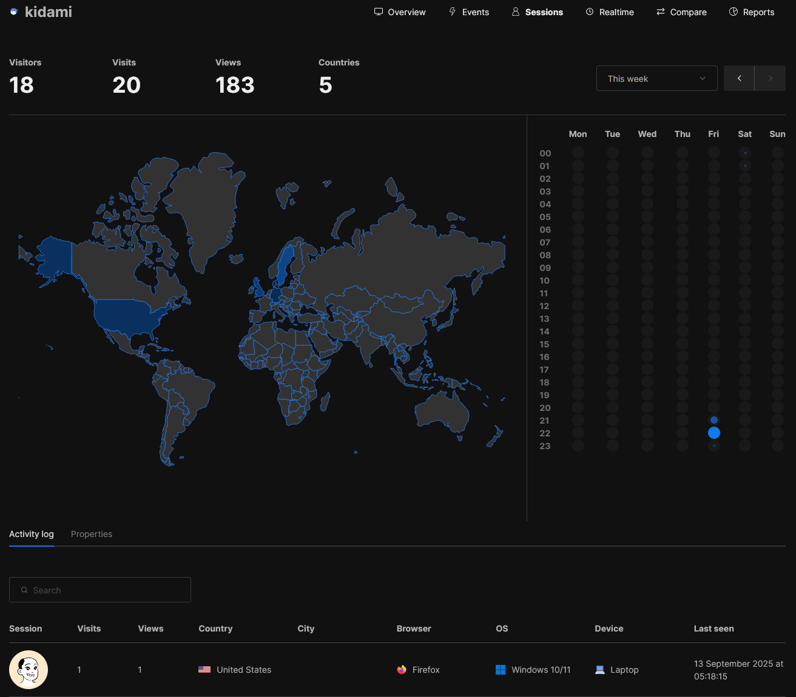
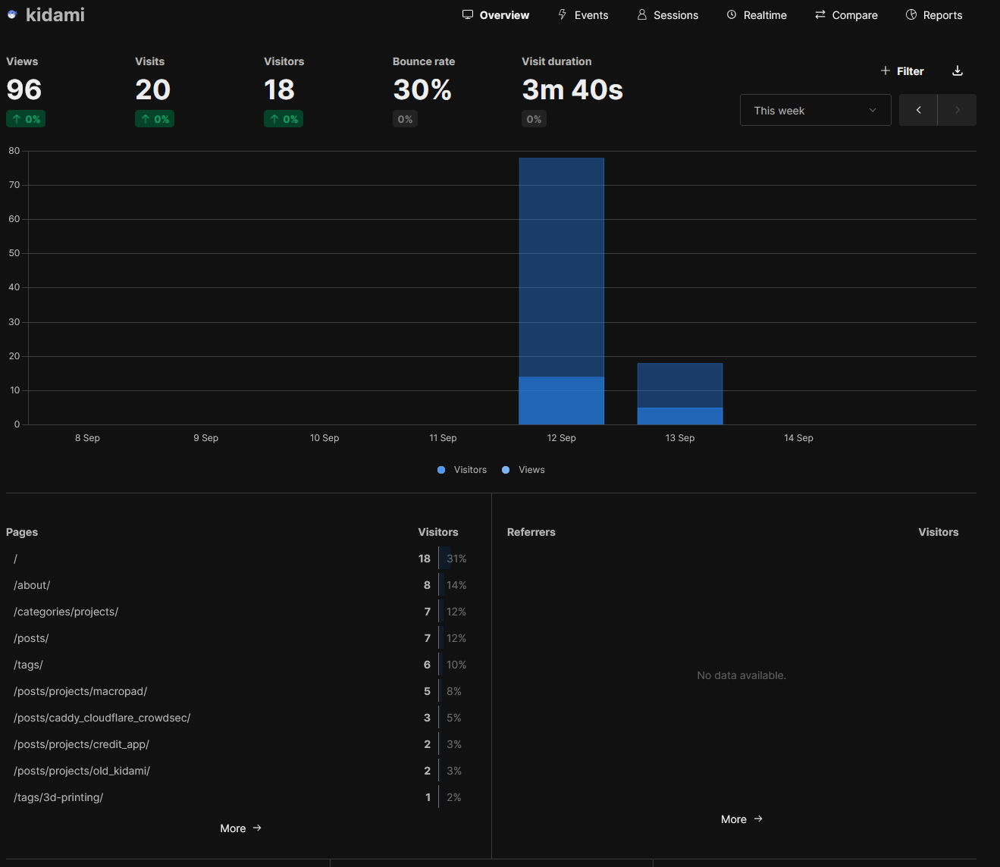
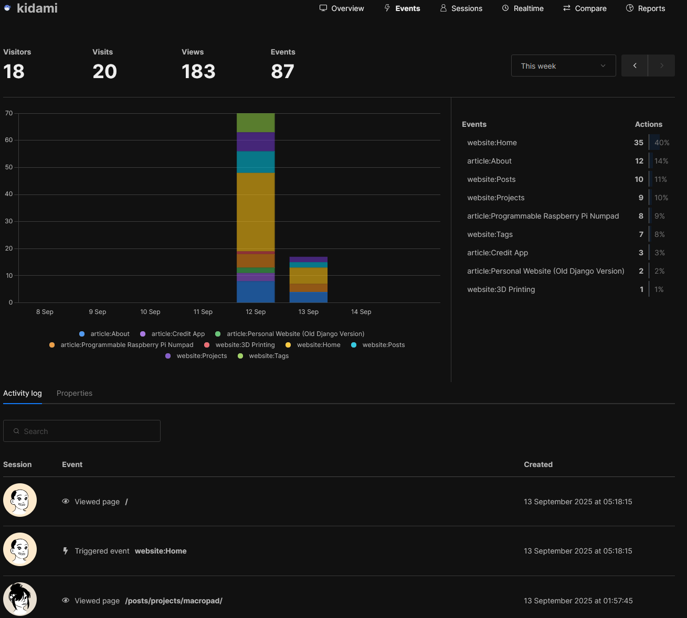

+++
date = '2025-09-13'
draft = false
title = 'Creating My New Site'
description = 'Overview of hosting a Hugo based site on GitHub Actions, and self hosting Umami analytics on an UNRAID server with Caddy as a reverse proxy.'
categories = ['Homelab']
tags = ['GitHub Actions', 'Tutorial', 'Self Hosting', 'Website', 'Hugo', 'Umami']
+++

Using GitHub Pages and Actions, Hugo, and Umami.

After deciding that its time to retire my old site due to something always being wrong with it (read: MongoDB issues, gunicorn issues, VM that it was hosted on issues), I needed to look for a replacement solution.

I looked into things such as **Ghost** but ultimately decided to go for something lighter and simpler - a static site generator such as **Hugo**. 

Better still, I could fully host this on GitHub's Pages infra with all the benefits such as caching, CDN, version history, and automated deployments.

---

## Why Hugo?

After running a full Django + Gunicorn + MongoDB stack for a while, I wanted something that:

- **Just works** – no fiddling with services or debugging why my VM is down.
- **Fast and lightweight** – pre-rendered static pages are hard to beat for speed.
- **Version-controlled** – every change tracked in Git.
- **Free hosting** – GitHub Pages takes care of infrastructure, HTTPS, and CDN caching. 

More importantly, if my server, electricity, or home internet were ever to go down the site should stay up.

Hugo ticked all of those boxes. It's a static site generator written in Go, which means:

- It's **very fast** – a site with hundreds of pages builds in milliseconds.
- It’s a **single binary**, no runtime dependencies.
- **Themes** are simple to install and customize.

By far the hardest part was deciding which theme to use... Luckily I had help choosing a theme, which led me to **Blowfish** – and I really like it

---

## Setting Up Hugo and GH Pages

Setting up Hugo is straightforward. I won't go over this here, but I can point you to the [official guide](https://gohugo.io/getting-started/quick-start/) which I used.

On GitHub's side of things you can follow [this guide](https://docs.github.com/en/pages/quickstart).

For the deploy action, I used the one available from GH marketplace after searching for Hugo, or you can see the one in my repo [here](https://github.com/michalkida/site/blob/master/.github/workflows/hugo.yml)

With this set up you should be able to **simply push** to your repository and have your site update in **under a minute**! Pretty cool.

### Using Custom Domains
Usually a site hosted on GH Pages will have a URL of your accounts name .github.io - something like `michalkida.github.io`

You can easily change this but one thing that threw me off slightly was the fact that I use cloudflare as my DNS provider. I had to create a CNAME pointing the `www` subdomain to the initial URL GitHub created for me (the `.github.io` one), but even after waiting for DNS to be refreshed they could not provision a cert correctly. 

To fix this, I had to **turn off the proxy status** for this record - which is fine as these are GHs servers, not mine.

---

## Setting Up Umami
But first, what is Umami? 

Its a **self-hostable, privacy-oriented analytics platform** which can track how many people actually interact with your site, all whilst being **GDPR compliant**, not using any tracking cookies, nor tracking across any other sites or selling any of your data.


  
  
  


### Docker Compose
I'm a big fan of UNRAID so I've this set up using the compose manager plugin. 

Here's my docker-compose.yml configuration:

```docker
services:
  umami:
    image: ghcr.io/umami-software/umami:postgresql-latest
    ports:
      - "<port on host>:3000"
    environment:
      DATABASE_URL: postgresql://umami:umami@db:5432/umami
      DATABASE_TYPE: postgresql
      APP_SECRET: <changeme>
      TRACKER_SCRIPT_NAME: my-analytics.js
      COLLECT_API_ENDPOINT: /analytics
    depends_on
      db:
        condition: service_healthy
    init: true
    restart: always
    healthcheck:
      test: ["CMD-SHELL", "curl http://localhost:3000/api/heartbeat"]
      interval: 5s
      timeout: 5s
      retries: 5
  db:
    image: postgres:15-alpine
    environment:
      POSTGRES_DB: umami
      POSTGRES_USER: umami
      POSTGRES_PASSWORD: umami
    volumes:
      - <path to data on host>:/var/lib/postgresql/data
    restart: always
    healthcheck:
      test: ["CMD-SHELL", "pg_isready -U $${POSTGRES_USER} -d $${POSTGRES_DB}"]
      interval: 5s
      timeout: 5s
      retries: 5
volumes:
  umami-db-data:
  ```

Key things to note
- You'll have to change the host port, `APP_SECRET`, and the path for the database.
- You also very likely want to change the `TRACKER_SCRIPT_NAME` and `COLLECT_API_ENDPOINT` env variables, as ad blockers such as uBlock will likely block an API endpoint and script called analytics.

### Site and Caddy Configuration

Once Umami is up and running you'll need to configure your site to download and use the tracking script. Luckily on Blowfish its [pretty simple](https://blowfish.page/docs/partials/#umami-analytics). 

My config is:
```toml
[umamiAnalytics]
  websiteid = "xxx"
  domain = "kidami.xyz/api"
  dataDomains = "www.kidami.xyz"
  scriptName = "analytics.js"
```
`domain` points to where my web server will expect requests to fetch the script and post back data. I do not add `COLLECT_API_ENDPOINT` here as Blowfish will automatically do this - so careful here if you're using a different theme/solution.

`dataDomains` restricts data collection to only this website.

`scriptName` is self explanatory and matches `TRACKER_SCRIPT_NAME` in the docker-compose.

For other setups you'll need to add a single line of code to the \<head\> of each page you want tracking for.

Something like:
```html
<script defer src="<umami_url>/<script_name>.js" data-website-id="1234"></script>
```

I use Caddy as my reverse proxy and decided to host the script and the collections endpoint at the root of my domain. I made this secure by ensuring only those two parts are exposed whilst the rest redirect back to this site on `www`.

```caddy
kidami.xyz {
	route {
		@umami_api {
            # Notice how these combine the Blowfish config + the Umami compose file
			path /api/analytics /api/my_analytics.js
		}
		handle @umami_api {
			# Allow requests from the Hugo site at www
			header Access-Control-Allow-Origin https://www.kidami.xyz
			header Access-Control-Allow-Methods "POST, GET, OPTIONS"
			header Access-Control-Allow-Headers "Content-Type"
			
			# respond to preflight
			@options method OPTIONS
			handle @options {
				respond 204
			}

			# Rewrite /api prefix before sending to Umami - this is only here as I wanted it to go to /api instead of my root domain, but Umami expects data at COLLECT_API_ENDPOINT
			@strip path_regexp stripapi ^/api/(.*)
			rewrite @strip /{http.regexp.stripapi.1}

			reverse_proxy <local server IP>:<umami port>
		}

		# Everything else redir
		redir https://www.kidami.xyz{uri} 301
	}
}
```

And voila. A much more robust, yet simpler solution compared to my old site (which you can read about below)
