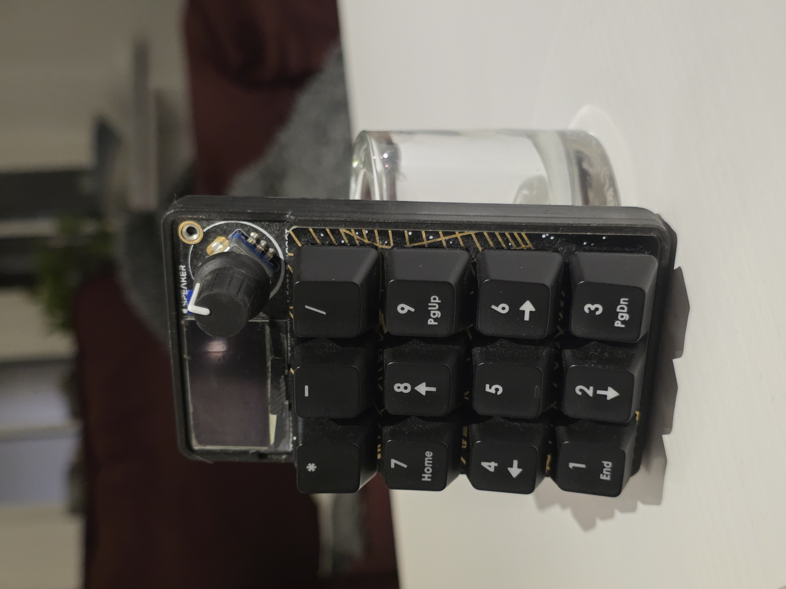
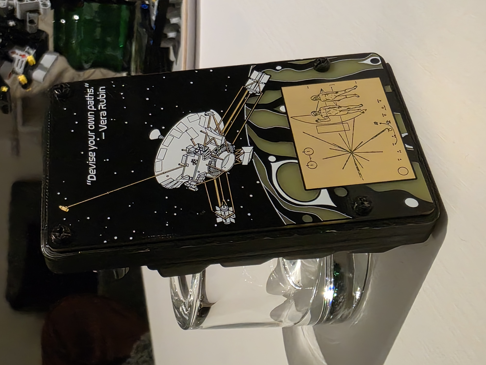
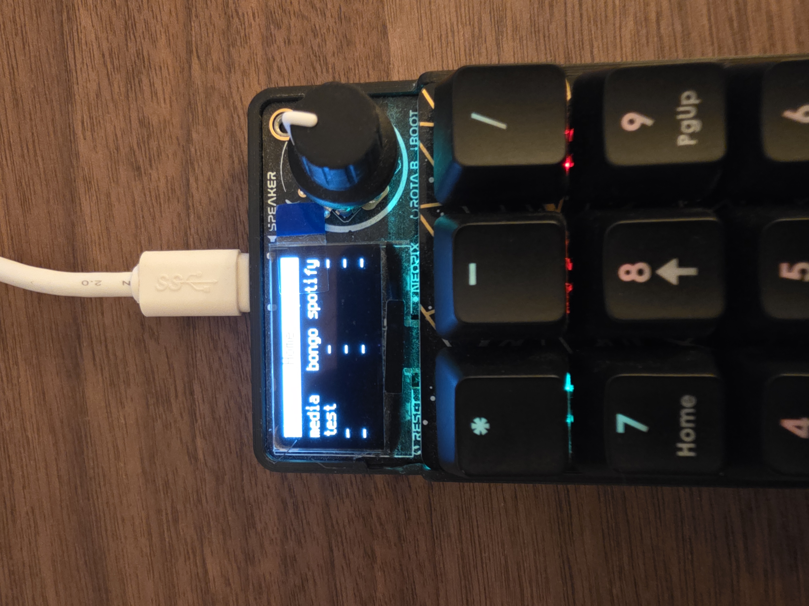
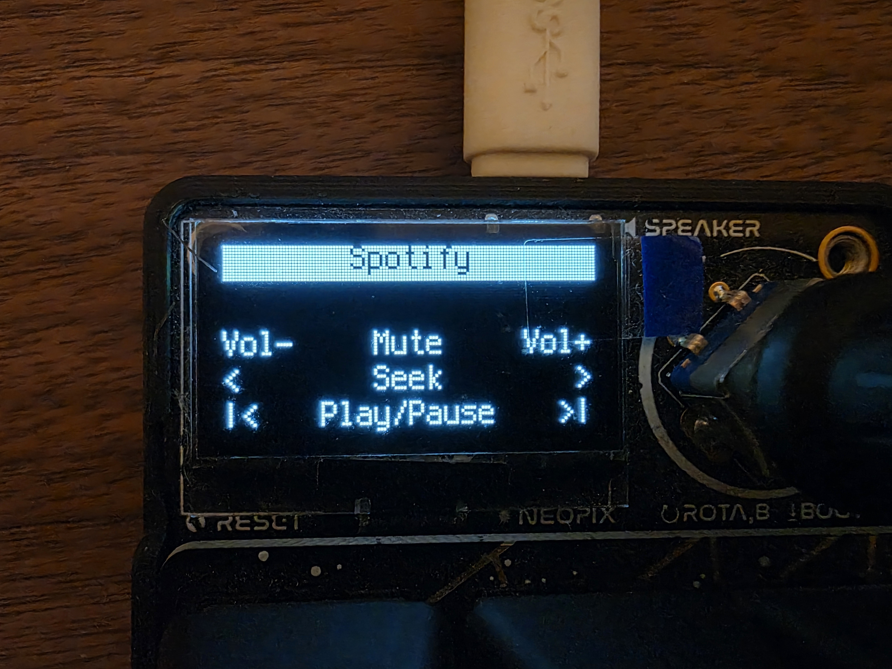
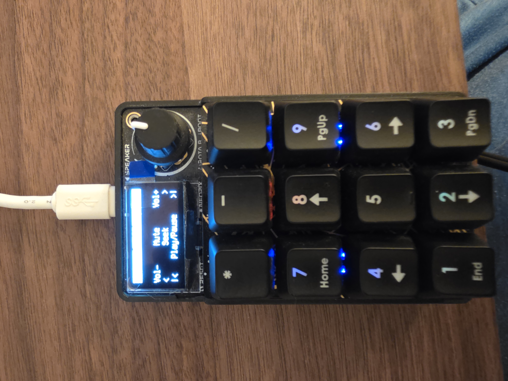

+++
date = '2024-05-15T00:00:00+02:00'
draft = false
title = 'Programmable Raspberry Pi Numpad'
categories = ['Projects']
tags = ['Python', '3D Printing']
+++

Featuring: Bongo Cat


{{< carousel images="{featured.jpg,pad_6.jpg}" >}}


  
  
  
  
  


This project started when I saw an image of a cool standalone numpad with an OLED display. With my 60% keyboard and no numpad (…plus that OLED display), I knew I had to build one.  

After some browsing, I settled on the **Adafruit MacroPad RP2040**, which had the perfect number of keys, LEDs, an OLED display, and was fully programmable with **CircuitPython**.  

I found an existing GitHub repository with basic functionality and expanded on it. My favorite feature is **Spotify control**: combining the MacroPad with **AutoHotkey’s DllCall**, I can send keystrokes directly to the Spotify client—even if it’s minimised or on another monitor. This includes:

- Controlling the app’s volume (not system-wide)  
- Skipping tracks  
- Seeking  
- Playing/pausing  

However, modern anticheat solutions (looking at you javelin) don't find this nowhere near as cool because any use of AHK is apparently bad 🥲

I also 3D printed a case for it (as the unit only comes with a backplate leaving a gap between the pad and itself), and fitted it with some Cherry MX Brown switches for that nice sound. Did I mention its fully hotswappable?

