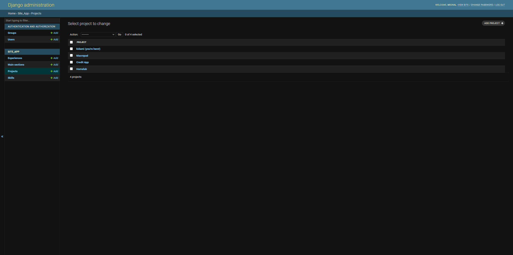
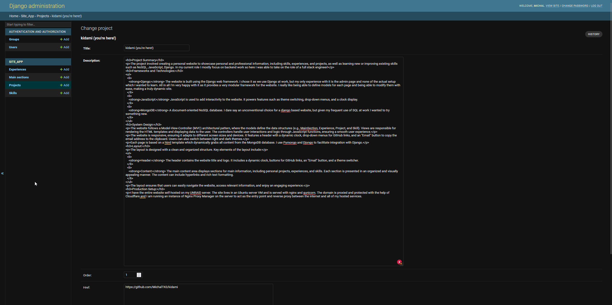

+++
date = '2023-11-19T00:00:00+02:00'
draft = false
title = 'Personal Website (Old Django Version)'
description = 'A retrospective of my old Django-based personal website: design, lessons learned, and what changed.'
categories = ['Projects']
tags = ['Unraid', 'Website', 'Django', 'Python', 'Web Development']
+++

This is my old website which I originally built to get familiar with Django and spice up the CV.



  
  
  
  
  
  
  


Below is the original and dated project summary for archival purposes.

## Project Summary

The project involved creating a personal website to showcase personal and professional information, including skills, experiences, and projects, as well as learning new or improving existing skills such as NoSQL, JavaScript, Django. In my current role I mostly focus on backend work so here I was able to take on the role of a full stack engineer!

### Frameworks and Technologies:
<ul>
  <li>
    <strong>Django:</strong> The website is built using the Django web framework. I chose it as we use Django at work, but my only experience with it is the admin page and none of the actual setup which I wanted to learn. All in all I'm very happy with it as it provides a very modular framework for the website. I really like being able to define models for each page and being able to modify them with ease, making a truly dynamic site.
  </li>
  <li>
    <strong>JavaScript:</strong> JavaScript is used to add interactivity to the website. It powers features such as theme switching, drop-down menus, and a clock display.
  </li>
  <li>
    <strong>MongoDB:</strong> A document-oriented NoSQL database. I dare say an unconventional choice for a django based website, but given my frequent use of SQL at work I wanted to try something new.
  </li>
</ul>

## System Design

The website follows a Model-View-Controller (MVC) architectural pattern, where the models define the data structures (e.g., MainSection, Experience, Project, and Skill). Views are responsible for rendering the HTML templates and displaying data to the user. The controllers handle user interactions and logic through JavaScript functions, ensuring a smooth user experience.

The website is responsive, ensuring it adapts to different screen sizes and devices. It features a header with a dynamic clock, drop-down menus for GitHub links, and an "Email" button to copy the email address to the clipboard. Users can also switch between light and dark themes.

Each page is based on a html template which dynamically grabs all content from the MongoDB database. I use Pymongo and Djongo to facilitate integration with Django.

## Layout

The layout is designed with a clean and organized structure. Key elements of the layout include:

<ul>
  <li>
    <strong>Header:</strong> The header contains the website title and logo. It includes a dynamic clock, buttons for GitHub links, an "Email" button, and a theme switcher.
  </li>
  <li>
    <strong>Content:</strong> The main content area displays sections for main information, including personal projects, experiences, and skills. Each section is presented in an organized and visually appealing manner. The content can include hyperlinks and rich text formatting.
  </li>
</ul>

The layout ensures that users can easily navigate the website, access relevant information, and enjoy an engaging experience.

## Production Setup

I have the entire website self-hosted on my UNRAID server. The site lives in an Ubuntu server VM and is served with nginx and gunicorn. The domain is proxied and protected with the help of Cloudflare and I am running an instance of Nginx Proxy Manager on the server to act as the entry point and reverse proxy between the internet and all of my hosted services.

